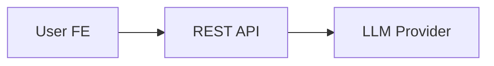
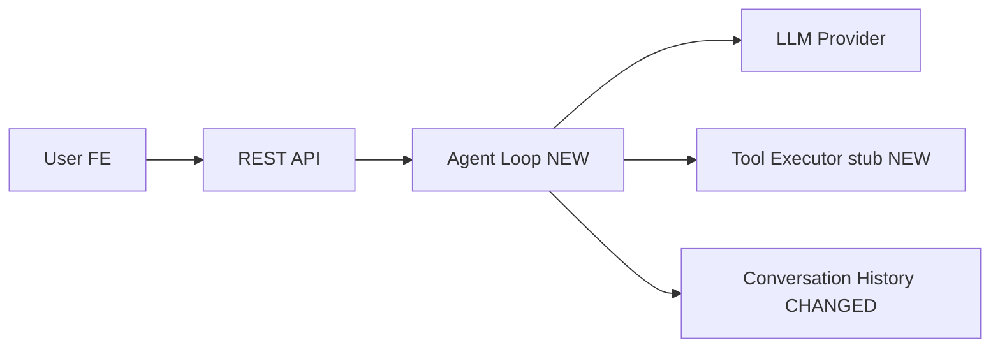

---

name: incremental-implementation
description: Implements a plan, spec, or design doc by breaking it into small digestible chunks — working with the user to clarify, implement, and verify each one before moving on. Visualizes every change so the user stays fully informed and understands what was built and why. Use this skill whenever a user wants to implement a plan and you want to make sure they understand everything being built. Trigger on phrases like "implement the plan", "let's build this step by step", "execute this plan", "start implementing", "work through the design doc", or when picking up a plan from docs/plans/. Also use proactively when a task involves building multiple files or modules from a written spec. This skill exists specifically to prevent vibe-coding — where AI does a large batch of work the user ends up not understanding.
---

# Incremental Implementation

**Asking questions:** At every checkpoint, use the `AskUserQuestion` tool (available in Claude Code, Codex, and compatible clients) to present structured choices rather than just asking in plain text. This keeps the user in a tight feedback loop without waiting for a new turn. If `AskUserQuestion` is not available in your environment, fall back to asking in plain text.

The goal is to keep the user informed and in control at every step. Large implementations go wrong not because the code is bad, but because the user doesn't understand what was built or why. This skill counters that by breaking work into verifiable units, explaining intent before coding, and showing a clear "what just changed and why" after each chunk.

## Step 0: Source the Problem — ISSUES.md + Chat Context (Priority Step)

**Before reading any plan file, resolve what problem is actually being solved.**

This step runs first and takes priority over everything else. The implementation input is assembled from two sources, merged in order of specificity:

### 0a. Check ISSUES.md

Look for `ISSUES.md` in the project root or the app directory (e.g. `apps/api/ISSUES.md`). If it exists, read it in full.

Extract from it:

- The **problem statement** — what is broken or missing and why it matters **test-runner**
- **Affected files and line ranges** — exact locations that need to change
- **Desired behavior** — what the fix must produce (success criteria)
- Any **constraints** — what must not change, what must remain backward-compatible

If `ISSUES.md` is absent, skip to Step 0b.

### 0b. Extract Context from the Current Chat

Read the conversation so far and extract:

- Any problem description, bug report, or goal the user stated
- File paths, function names, or code snippets the user referenced
- Any constraints or preferences the user expressed

### 0c. Merge and Confirm the Problem Statement

Combine both sources into a single problem statement. ISSUES.md takes precedence where the two overlap. Present it to the user before proceeding:

```
Problem: [1–3 sentence summary of what's broken and what the fix must achieve]
Scope: [files and layers affected]
Success criteria: [observable behavior when the fix is correct]
Source: [ISSUES.md / chat / both]
```

Use the `AskUserQuestion` tool to ask: "Is this the right problem to solve?" with options like "Yes, proceed", "Adjust the scope", "Different problem entirely", or "Other".

Only move to Step 1 after the user confirms.

---

## Step 1: Read and Internalize the Plan

Read the full plan before doing anything else. If it isn't shared, ask the user to provide it (a file path, a paste, or a description is fine). If the problem was sourced entirely from ISSUES.md + chat in Step 0, treat that merged problem statement as the plan input — no separate plan file is required.

As you read, identify:

- The major components, modules, or layers to be built or changed
- Dependencies between them (what must exist before what)
- Natural "seams" — places where something will visibly work after the chunk is done

## Step 2: Propose a Chunk Breakdown

Before writing a single line of code, show the user how you plan to slice the work. Ground the breakdown in the confirmed problem statement from Step 0 — each chunk should map to a concrete part of the fix or feature, not an abstract layer.

Present it clearly, for example:

```
Proposed implementation chunks:

[1] Project scaffold — folder structure, tsconfig, package.json, dev tooling
[2] Storage layer — JSON file read/write, conversation index
[3] LLM provider interface — abstract interface + first adapter (e.g. Anthropic)
[4] Agentic loop skeleton — basic chat, no tools yet
[5] Built-in tools — web_search, web_fetch, load_skill
[6] MCP client integration — connect to MCP servers, merge tool list
[7] REST API + SSE streaming — Express routes, streaming responses

Chunk 4 depends on 2 and 3. Chunks 5–6 depend on 4. Chunk 7 depends on all.
```

Use the `AskUserQuestion` tool to ask: "Does this breakdown look right? Anything you'd re-slice or re-order?" with options like "Looks good, let's start", "I'd like to re-slice", "Re-order some chunks", or "Other".

Wait for the user to confirm before starting.

## Step 2b: Initialize progress.md

Once the chunk breakdown is confirmed, create a `progress.md` file in the project root (or alongside the plan file if one was provided). This file is the implementation log — it will be updated after every chunk.

Seed it with the plan overview and chunk list:

```markdown
# Implementation Progress

## Plan Overview
[1–3 sentence summary of what's being built]

## Chunks
- [ ] [1] Chunk name — brief description
- [ ] [2] Chunk name — brief description
...

---
```

## Step 2c: Initialize Specs Documentation

For every feature, fix, or issue being implemented, create a documentation directory under `specs/` using the format:

```
specs/<slug>/
  PLAN.md
  SUMMARY.md
```

Where:

- `<slug>` is a kebab-case name describing the feature or fix (e.g. `streaming-retry-logic`, `fix-kb-fallback`)

Artifact + slug convention: specs/README.md + .claude/rules/plan-format.md

The `PLAN.md` file serves as the **living spec document** for the current implementation. Save all related plans, design decisions, research notes, constraints, and architecture diagrams here as you work through the chunks. Update it incrementally as decisions are made or clarified.

Seed `PLAN.md` with:

```markdown
# [Feature/Fix Name]

**Date:** YYYY-MM-DD
**Source:** ISSUES.md / chat / both

## Problem Statement
[From Step 0c]

## Plan
[Chunk breakdown from Step 2]

## Design Decisions
[Append decisions as they are made during implementation]

## Notes
[Append any research, constraints, or gotchas discovered during implementation]
```

## Step 3: Work Through Each Chunk

For each chunk, follow this sequence — every time, without skipping steps. Respect dependencies:

- Dependent chunks run in order.
- Independent chunks may run in parallel and do not need to wait for unrelated chunks to finish.

**Before the first chunk:** if a `specs/<slug>/PLAN.md` exists, set its frontmatter
`status: active` (from `proposed`) — `hooks/blast-radius-check.sh` keys on it, and the edit
auto-re-renders `PLAN.html`. Canonical values only: `proposed | active | paused | shipped`.

### 3a. Brief the user

In 2–4 sentences: what you're about to build, which files you'll create or modify, and what this chunk connects to. No code yet — just intent. This gives the user a chance to redirect before any work is done.

### 3b. Clarify

Use the `AskUserQuestion` tool to ask if the user has any questions or wants to adjust the approach for this chunk. Offer options like "Looks good, proceed", "I have a question", or "Adjust the approach". One short exchange is enough. If they want to dig into something, take the time — the whole point is that they stay oriented. Don't rush past this.

### 3c. Implement

Invoke the `coding` sub-agent via the `Task` tool to implement each chunk. Stay focused on what the chunk describes. Resist the urge to clean up adjacent code, add extra features, or sneak in improvements that weren't part of the plan — those belong in their own chunks.

If multiple chunks are independent (no direct dependency between them), launch multiple `coding` sub-agent tasks in parallel. Do not block Chunk A waiting for Chunk B if they are unrelated. Track each chunk independently through implement -> test -> verify, and only gate on dependency edges.

### 3d. Visualize and Log

After implementation, show the user what was built **and append the chunk's entry to `progress.md`**.

**Choose a Mermaid diagram type** that best communicates the change:

- `**graph LR`** — data flow, request paths, module dependencies
- `**sequenceDiagram`** — request/response cycles, multi-step logic, API calls
- `**classDiagram**` — object relationships, interface hierarchies
- `**flowchart TD**` — conditional logic, branching decision trees

Always show a **before** diagram (what existed prior) and an **after** diagram (what exists now). If nothing existed before, label the before section "Before: nothing" and skip the diagram.

Mark new nodes with a `:::new` CSS class or a `(NEW)` label suffix. Mark modified nodes with `(CHANGED)`.

**Append to `progress.md` after each chunk:**

```markdown
---

## Chunk [N]: [Chunk Name]

**Status:** ✅ Complete
**Files changed:** `src/agent/loop.ts` (created), `src/providers/base.ts` (created)

### What changed
[2–4 sentences explaining what was built, what problem it solves, and how it connects to neighboring chunks.]

### Before

[Mermaid diagram of the system state before this chunk, OR "Before: nothing" if this is the first chunk]

### After

[Mermaid diagram showing the full updated system with new/changed elements labeled]

### Data / Logic Flow

[Optional: a sequence or flowchart diagram walking through how data moves through what was just built. Use this when the "after" structural diagram doesn't capture runtime behavior well.]

### Tests
- Runner: invok the sub-agent "test-runner" to run the tests
- Result: ✅ N passed / ❌ N failed
- Files tested: `tests/path/to/test_file.py`
```

**Example entry:**

```markdown
---

## Chunk 4: Agentic Loop Skeleton

**Status:** ✅ Complete
**Files changed:** `src/agent/loop.ts` (created), `src/agent/types.ts` (created)

### What changed
Introduced the core agentic loop that drives multi-turn conversations. It receives a user message, appends it to history, calls the LLM, and streams the response. Tool execution is stubbed — it will be wired in Chunk 5.

### Before



### After




### Data / Logic Flow

```mermaid
sequenceDiagram
  participant FE as User FE
  participant API as REST API
  participant Loop as Agent Loop
  participant LLM as LLM Provider

  FE->>API: POST /messages
  API->>Loop: run(message, history)
  Loop->>LLM: chat(history + message)
  LLM-->>Loop: stream tokens
  Loop-->>API: streamed response
  API-->>FE: SSE chunks
```


### Tests

- Runner: test-runner sub-agent
- Result: ✅ 6 passed
- Files tested: `tests/agent/test_loop.py`

Keep the inline chat summary brief — the `progress.md` entry is the durable record. Don't duplicate all the diagram content in chat; a short prose summary and a pointer ("see progress.md for diagrams") is enough.

### 3e. Run Tests via test-runner Sub-Agent

After implementation, invoke the 4 `test-runner` sub-agents using the `Task` tool to execute the tests relevant to this chunk. Pass it the list of files created or modified so it can target the minimal test set.

The sub-agent will:
- Identify and run the relevant test files (e.g. `tests/repositories/test_user.py` for changes to `app/repositories/user.py`)
- Report pass/fail counts, tracebacks, and actionable fix suggestions on failure

**On failure:** Do not mark that chunk complete. Fix the failing tests now, then re-invoke the sub-agent to confirm they pass before closing that chunk.

**On success:** Note the test results in that chunk's `progress.md` entry:

```markdown
### Tests
- Runner: test-runner sub-agent
- Result: ✅ N passed / ❌ N failed
- Files tested: `tests/path/to/test_file.py`
```

### 3f. Verify

Use the `AskUserQuestion` tool to ask: "Does this look right before we move on to [next chunk name]?" with options like "Yes, move on", "I have a question", "Fix something first", or "Other".

Give the user a real chance to inspect, question, or push back. Only move forward when they confirm. If they spot an issue, fix it now — not in a later chunk.

---

## Chunking Heuristics

A well-sized chunk:

- Covers a single layer or abstraction (e.g., "the storage layer", "the provider interface")
- Produces something observable after it's done (a test passes, a route responds, a file is readable)
- Touches 1–4 files

A chunk is probably too big if:

- Its description needs "and also" more than twice
- It creates more than 5 new files at once
- You'd struggle to explain it clearly in 3 sentences

A chunk is too small if:

- It's a single type definition or one-liner
- It produces nothing observable on its own

When in doubt, err toward smaller chunks — the user can always say "combine these two."

---

## Handling Surprises Mid-Chunk

If you discover something unexpected mid-implementation — a missing dependency, a design conflict, something the plan didn't account for — pause and surface it rather than quietly working around it. Explain what you found and why it matters, then use the `AskUserQuestion` tool to ask how the user wants to handle it (e.g. "Update the plan", "Work around it", "Skip for now", "Other").

Same for plan errors: if something in the plan doesn't make sense or conflicts with something already built, flag it before implementing. It's far easier to change direction at the start of a chunk than to untangle it at the end.

---

## Wrapping Up

After all chunks are verified:

1. **Archive to LIFE_TIME_ISSUES.md** — Before clearing `ISSUES.md`, append the resolved issue to `LIFE_TIME_ISSUES.md` (at `apps/api/LIFE_TIME_ISSUES.md`) for long-term tracking. Use the following format:

```markdown
## YYYY-MM-DD

### ✅ DONE — [Issue Title / Feature Name]

[Original problem statement from ISSUES.md, kept brief — 1–3 sentences]

**Files changed:** [list of key files]
**Chunks completed:** [N]
```

Append to the end of the file. Do not overwrite existing entries — `LIFE_TIME_ISSUES.md` is an append-only log.

2. **Clear ISSUES.md** — After archiving to `LIFE_TIME_ISSUES.md`, remove the resolved issue entry from `ISSUES.md` (or reset it to the default "No open issues" state if it was the only entry). Use the `AskUserQuestion` tool to confirm: "The issue has been archived to LIFE_TIME_ISSUES.md. Should I clear it from ISSUES.md?" with options "Yes, clear it", "Keep it for reference", or "Other". Do not clear it without user confirmation.

3. **Finalize `progress.md`** — append a closing section:

```markdown
---

## Final System Overview

### Architecture

[A single Mermaid diagram showing the complete system as built — all layers, modules, and data flows]

### Summary
[3–5 bullets: what was built, how pieces connect, what to do next]
```

4. **Write Final Report to Specs** — After all tests pass via the `test-runner` sub-agents, copy the complete content of `progress.md` to `specs/<slug>/SUMMARY.md` (using the same feature directory in Step 2c). This serves as the permanent record of the implementation. The `SUMMARY.md` should contain the exact same content as the finalized `progress.md`, including all chunk entries, diagrams, test results, and the final system overview.

5. **Clean `progress.md` file** — After finalizing the report, auto clean content of `progress.md` file.

6. **Give a brief inline summary** in chat:
   - What was built across the whole implementation
   - How the major pieces connect to each other
   - What to do next (how to run it, what's missing, what's a natural next phase)

7. **Create PR Template** — As the very last step, invoke the `create-pr` skill to generate a Pull Request template for the current branch. It will analyze the git diff, generate a structured PR description, and write it to `specs/<slug>/PR_TEMPLATE.md`. This step runs automatically — no user confirmation needed.

The `progress.md` file and `specs/<slug>/SUMMARY.md` are the durable artifacts the user can keep, share, or reference later. The inline summary is just a pointer to orient them in the moment.

---

## Staying Grounded

The per-chunk verification loop is the point of this skill. Do not skip verification for any chunk. Keep dependency-ordered chunks sequential, but run truly independent chunks in parallel when it improves throughput without reducing user clarity.
