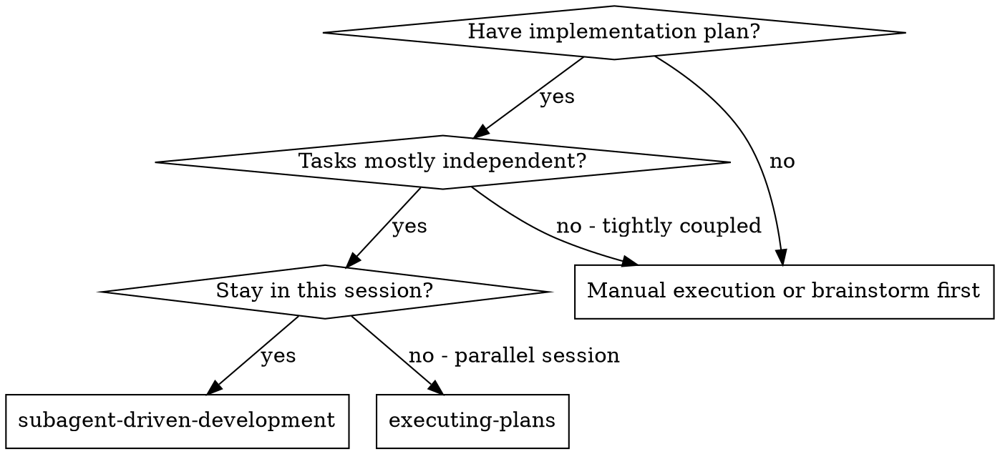
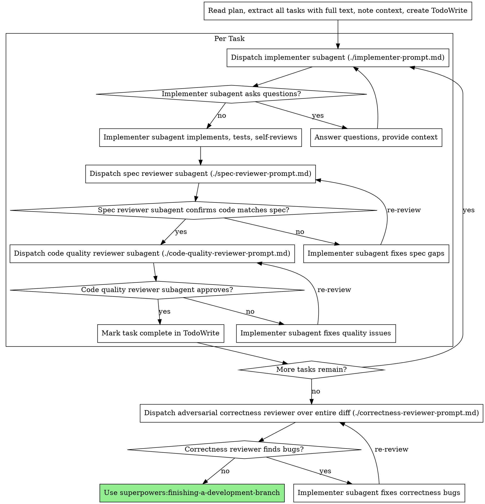

# Subagent-Driven Development

Execute plan by dispatching fresh subagent per task, with two-stage review after each: spec compliance review first, then code quality review. After **all** tasks are done, run one final adversarial correctness review over the entire diff before shipping.

**Why subagents:** You delegate tasks to specialized agents with isolated context. By precisely crafting their instructions and context, you ensure they stay focused and succeed at their task. They should never inherit your session's context or history — you construct exactly what they need. This also preserves your own context for coordination work.

**Core principle:** Fresh subagent per task + two-stage review (spec then quality) = high quality, fast iteration

## When to Use



**vs. Executing Plans (parallel session):**
- Same session (no context switch)
- Fresh subagent per task (no context pollution)
- Two-stage review after each task: spec compliance first, then code quality
- Faster iteration (no human-in-loop between tasks)

## The Process

**First action — mark the plan active.** Before dispatching wave 1, set the frontmatter
`status: proposed → active` in `specs/<slug>/PLAN.md` (canonical values only:
`proposed | active | paused | shipped`). `hooks/blast-radius-check.sh` keys on `status: active` to
identify the active plan, and the edit auto-re-renders `PLAN.html` via `render-plan-on-write.sh`.
Append commit shas to `## Status Log` after each wave (`rules/wave-parallelism.md`); the `shipped`
transition happens later in `finishing-a-development-branch`.



## Wave-aware parallelism policy

This skill can execute implementation tasks in parallel **only** when they are grouped in the same `wave` and are safe to run concurrently.

Parallel dispatch is allowed when ALL are true:

- Tasks are in the same wave from `specs/<slug>/PLAN.md`
- File sets are disjoint (zero overlap)
- No unresolved task dependency inside the wave
- Controller dispatches all wave tasks in ONE assistant message (parallel tool calls)

Use sequential dispatch when ANY are true:

- Tasks touch the same file(s)
- A task depends on outputs of another task in the same wave
- Task scope is ambiguous and requires clarification first

When in doubt, choose sequential execution and re-plan waves before parallelizing.

## Model Selection

Use the least powerful model that can handle each role to conserve cost and increase speed.

**Mechanical implementation tasks** (isolated functions, clear specs, 1-2 files): use a fast, cheap model. Most implementation tasks are mechanical when the plan is well-specified.

**Integration and judgment tasks** (multi-file coordination, pattern matching, debugging): use a standard model.

**Architecture, design, and review tasks**: use the most capable available model.

**Task complexity signals:**
- Touches 1-2 files with a complete spec → cheap model
- Touches multiple files with integration concerns → standard model
- Requires design judgment or broad codebase understanding → most capable model

## Handling Implementer Status

Implementer subagents report one of four statuses. Handle each appropriately:

**DONE:** Proceed to spec compliance review.

**DONE_WITH_CONCERNS:** The implementer completed the work but flagged doubts. Read the concerns before proceeding. If the concerns are about correctness or scope, address them before review. If they're observations (e.g., "this file is getting large"), note them and proceed to review.

**NEEDS_CONTEXT:** The implementer needs information that wasn't provided. Provide the missing context and re-dispatch.

**BLOCKED:** The implementer cannot complete the task. Assess the blocker:
1. If it's a context problem, provide more context and re-dispatch with the same model
2. If the task requires more reasoning, re-dispatch with a more capable model
3. If the task is too large, break it into smaller pieces
4. If the plan itself is wrong, escalate to the human

**Never** ignore an escalation or force the same model to retry without changes. If the implementer said it's stuck, something needs to change.

## Final Adversarial Correctness Review

After every task's spec + quality review passes, run **one** adversarial correctness review
over the entire implementation diff (`./correctness-reviewer-prompt.md`) before handing off to
`finishing-a-development-branch`.

**Why this stage exists.** The per-task spec and quality reviewers are anchored to the plan as
the oracle — spec review asks *"does it match the spec?"*, quality review asks *"is it
clean?"*. Neither asks *"cho dù spec đúng, code này có chạy sai ở runtime không?"*. A bug that
faithfully implements a flawed spec passes both. This is the gap that lets real bugs survive to
production and get caught by external reviewers post-push.

**Step 0 — compound read-back.** Before scanning the diff, the reviewer reads
`docs/solutions/critical-patterns.md` and all `failure`-track entries in `docs/solutions/`
when present. Each past bug becomes a named check — this closes the compound loop at review
time, so a pattern the team already paid to learn cannot slip through again. Degrade
gracefully: if `docs/solutions/` is absent or empty, skip this step and proceed.

**What makes it different:**

- **Ignores the plan.** Validates against actual runtime behavior, not stated intent.
- **Adversarial.** Assumes ≥1 bug exists and hunts specific bug classes (None/async/DB/auth/
  concurrency/contract breaks) rather than confirming compliance.
- **Whole-diff.** Runs once over the full implementation, so it catches integration bugs that
  span tasks — invisible to any single per-task review.
- **Different model.** Dispatch with a different (ideally most capable) model than the
  implementer for ensemble diversity.

**Pipeline order.** The correctness stage runs in five steps — FIND → SCORE → THRESHOLD → D → E:

1. **FIND** (`./correctness-reviewer-prompt.md`) — high-recall; flags every plausible candidate.
   The finder is deliberately biased toward false positives; it does not self-filter.
2. **SCORE** (`./correctness-scorer-prompt.md`) — a cheap-model agent scores each candidate
   0–100 in independent context (no access to the finder's reasoning). One scorer agent per
   finding; dispatch in parallel. Rubric: 0 = false positive / pre-existing / not on changed
   line · 25 = maybe real, unverified · 50 = real but minor or rare · 75 = highly confident ·
   100 = certain, confirmed by code. Score 0 automatically when `ruff-on-edit`,
   `commit-quality-gate`, or `risk-corroboration` would already catch it.
3. **THRESHOLD** — drop findings with `score < 80`. Record them as `advisory` in
   `specs/<slug>/SUMMARY.md` under `### Advisory Findings` (not silently dropped, not
   escalated). The threshold is adjustable (lower for high-risk lanes, higher when
   false-positive noise is a known problem); default is **80**.
4. **D — two-axis classification.** Findings that survive the threshold carry two labels:

- **Severity** — `P0` (data loss / security / crash) · `P1` (wrong output / broken path) ·
  `P2` (degraded behavior, non-fatal) · `P3` (minor correctness issue)
- **Rule class** — per `.claude/rules/auto-correct-scope.md`: `Rule 1` (auto-fix obvious bug) ·
  `Rule 2` (auto-add missing standards) · `Rule 3` (auto-fix blocker) · `Rule 4` (STOP — needs
  architectural judgment)

5. **E — residual gate + fix-loop.** See fix routing and residual work gate below.

**Fix routing by Rule class:**

- **Rule 1–3** → implementer auto-fixes (fresh dispatch) → re-review → repeat until ✅. Log
  each fix as a deviation in `SUMMARY.md`.
- **Rule 4** → STOP immediately. Do not attempt a fix. Write the finding to
  `specs/<slug>/ESCALATIONS.md` and surface to the user before proceeding. The plan was wrong
  or underspecified; a human must narrow scope.

**Residual work gate.** Before handing off to `finishing-a-development-branch`, every finding
must be in one of two states: fixed (✅, with a commit sha) or durably recorded
(`SUMMARY.md` for Rule 1–3 carry-overs, `ESCALATIONS.md` for Rule 4 blocks). A finding with
neither is a hard block — do not hand off.

**Relationship to `/code-review`:** this is the always-on in-flow gate. For high-risk lanes you
may *additionally* run `/code-review high|ultra` before merge — they compound, they don't
replace each other.

## Reporting — Rule 1–3 Deviation Logging

Every implementer subagent MUST classify and log each auto-fix it applied during task
execution against `.claude/rules/auto-correct-scope.md` Rules 1–3. The subagent's return
payload MUST include the `deviations` field (see `./implementer-prompt.md` return contract).

Cross-references:

- `.claude/rules/auto-correct-scope.md` — definitions for Rule 1 (auto-fix bugs),
  Rule 2 (auto-add missing standards-driven functionality), Rule 3 (auto-fix blocking
  issues), and Rule 4 STOP cases that must never be auto-applied.
- `.claude/rules/orchestration.md` — subagent contract section (every returning
  subagent reports Commits, Files, Deviations, Blockers, Verify status).

**Destination.** The controller aggregates each task's `deviations` and appends them
to `specs/<slug>/SUMMARY.md` under a `### Deviations` block. One entry per auto-fix.

Entry shape (Markdown bullet):

```markdown
### Deviations

- Rule 2 — Added `AppException.BadRequest` for invalid trade_type. `app/services/trade_log_service.py`. Commit `abc1234`.
- Rule 3 — Added `httpx>=0.27` to requirements.txt. Needed by new broker client. Commit `def5678`.
```

Required fields per entry: rule number (1|2|3), short description, file path, commit
sha (when applicable). If no deviations were applied on a task, the subagent still
returns `deviations: []` and the controller adds no entry for that task.

If the same deviation re-appears across tasks, surface it to the user as a PLAN.md gap
per `auto-correct-scope.md` → Reporting.

## Prompt Templates

- `./implementer-prompt.md` - Dispatch implementer subagent
- `./spec-reviewer-prompt.md` - Dispatch spec compliance reviewer subagent (per task)
- `./code-quality-reviewer-prompt.md` - Dispatch code quality reviewer subagent (per task)
- `./correctness-reviewer-prompt.md` - Dispatch final adversarial correctness reviewer (once, whole diff)
- `./correctness-scorer-prompt.md` - Dispatch cheap-model scorer per candidate finding (SCORE stage, 0–100, threshold 80)

## Example Workflow

```
You: I'm using Subagent-Driven Development to execute this plan.

[Read plan file once: docs/superpowers/plans/feature-plan.md]
[Extract all 5 tasks with full text and context]
[Create TodoWrite with all tasks]

Task 1: Hook installation script

[Get Task 1 text and context (already extracted)]
[Dispatch implementation subagent with full task text + context]

Implementer: "Before I begin - should the hook be installed at user or system level?"

You: "User level (~/.config/superpowers/hooks/)"

Implementer: "Got it. Implementing now..."
[Later] Implementer:
  - Implemented install-hook command
  - Added tests, 5/5 passing
  - Self-review: Found I missed --force flag, added it
  - Committed

[Dispatch spec compliance reviewer]
Spec reviewer: ✅ Spec compliant - all requirements met, nothing extra

[Get git SHAs, dispatch code quality reviewer]
Code reviewer: Strengths: Good test coverage, clean. Issues: None. Approved.

[Mark Task 1 complete]

Task 2: Recovery modes

[Get Task 2 text and context (already extracted)]
[Dispatch implementation subagent with full task text + context]

Implementer: [No questions, proceeds]
Implementer:
  - Added verify/repair modes
  - 8/8 tests passing
  - Self-review: All good
  - Committed

[Dispatch spec compliance reviewer]
Spec reviewer: ❌ Issues:
  - Missing: Progress reporting (spec says "report every 100 items")
  - Extra: Added --json flag (not requested)

[Implementer fixes issues]
Implementer: Removed --json flag, added progress reporting

[Spec reviewer reviews again]
Spec reviewer: ✅ Spec compliant now

[Dispatch code quality reviewer]
Code reviewer: Strengths: Solid. Issues (Important): Magic number (100)

[Implementer fixes]
Implementer: Extracted PROGRESS_INTERVAL constant

[Code reviewer reviews again]
Code reviewer: ✅ Approved

[Mark Task 2 complete]

...

[After all tasks — final adversarial correctness review over the whole diff]
[Dispatch correctness reviewer (different model) with ./correctness-reviewer-prompt.md]
Correctness reviewer: 🐛 P1 / Rule 1 — app/services/trade_log_service.py:42
  Trigger: get_recent() called for a user with zero logs
  Wrong outcome: returns None, router does len(None) → 500
  Fix: return [] when query yields nothing

[Implementer fixes: return empty list]
[Re-dispatch correctness reviewer]
Correctness reviewer: ✅ No correctness defects found. Paths traced:
  create_entry happy + invalid trade_type, get_recent empty + populated, soft-deleted filter

[Hand off to finishing-a-development-branch]

Done!
```

## Advantages

**vs. Manual execution:**
- Subagents follow TDD naturally
- Fresh context per task (no confusion)
- Parallel-safe (subagents don't interfere)
- Subagent can ask questions (before AND during work)

**vs. Executing Plans:**
- Same session (no handoff)
- Continuous progress (no waiting)
- Review checkpoints automatic

**Efficiency gains:**
- No file reading overhead (controller provides full text)
- Controller curates exactly what context is needed
- Subagent gets complete information upfront
- Questions surfaced before work begins (not after)

**Quality gates:**
- Self-review catches issues before handoff
- Two-stage review: spec compliance, then code quality
- Review loops ensure fixes actually work
- Spec compliance prevents over/under-building
- Code quality ensures implementation is well-built
- Final adversarial correctness review catches runtime bugs the plan-anchored reviewers miss (different model, whole diff)

**Cost:**
- More subagent invocations (implementer + 2 reviewers per task)
- Controller does more prep work (extracting all tasks upfront)
- Review loops add iterations
- But catches issues early (cheaper than debugging later)

## Red Flags

**Never:**
- Start implementation on main/master branch without explicit user consent
- Skip reviews (spec compliance OR code quality)
- Proceed with unfixed issues
- Dispatch implementation subagents in parallel when file overlap or unresolved dependencies exist
- Make subagent read plan file (provide full text instead)
- Skip scene-setting context (subagent needs to understand where task fits)
- Ignore subagent questions (answer before letting them proceed)
- Accept "close enough" on spec compliance (spec reviewer found issues = not done)
- Skip review loops (reviewer found issues = implementer fixes = review again)
- Let implementer self-review replace actual review (both are needed)
- **Start code quality review before spec compliance is ✅** (wrong order)
- Move to next task while either review has open issues
- **Skip the final adversarial correctness review, or hand off to `finishing-a-development-branch` with open correctness bugs** (this is the gate that catches runtime bugs the spec/quality reviewers miss)
- Run the final correctness review with the same model as the implementer (defeats ensemble diversity)

**If subagent asks questions:**
- Answer clearly and completely
- Provide additional context if needed
- Don't rush them into implementation

**If reviewer finds issues:**
- Implementer (same subagent) fixes them
- Reviewer reviews again
- Repeat until approved
- Don't skip the re-review

**If subagent fails task:**
- Dispatch fix subagent with specific instructions
- Don't try to fix manually (context pollution)

## Integration

**Required workflow skills:**
- **superpowers:using-git-worktrees** - REQUIRED: Set up isolated workspace before starting
- **superpowers:writing-plans** - Creates the plan this skill executes
- **superpowers:requesting-code-review** - Code review template for reviewer subagents
- **superpowers:finishing-a-development-branch** - Complete development after all tasks

**Subagents should use:**
- **superpowers:test-driven-development** - Subagents follow TDD for each task

**Alternative workflow:**
- **superpowers:executing-plans** - Use for parallel session instead of same-session execution
